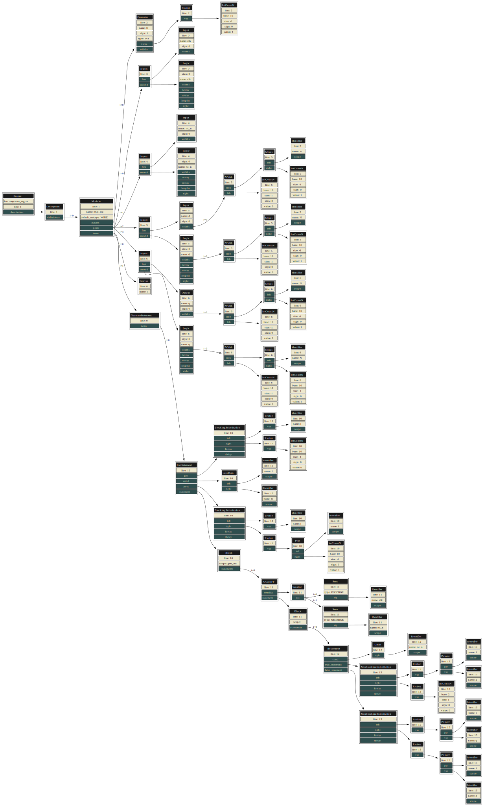
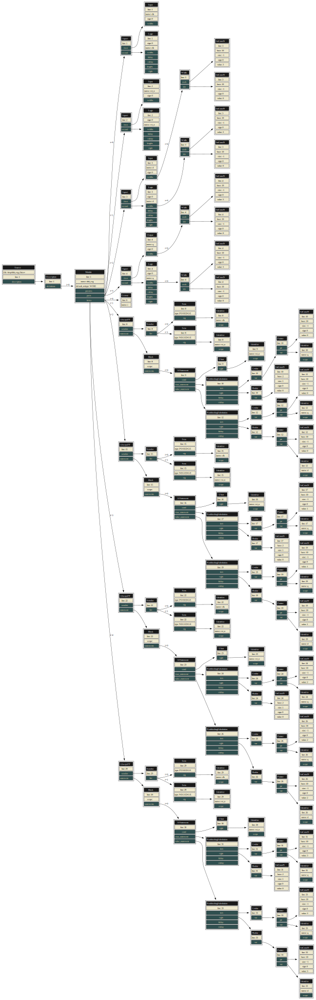

# Veriparse

Veriparse is a **source-to-source transformation** toolkit for synthesizable Verilog and SystemVerilog designs. It provides **flattening** and **obfuscation** of hierarchical designs, supporting a significant subset of synthesizable SystemVerilog constructs (generate blocks, `always_ff`, `always_comb`, `logic` types, etc.). It is intended to help IP vendors protect their designs while still delivering functional, simulatable netlists. It also serves as an **RTL elaboration tool** to retarget generic, parametric designs for FPGA toolchains with limited synthesis support: for instance, complex ROM or LUT initialization expressed as Verilog functions or generate loops can be fully unrolled and constant-folded into plain, widely-supported RTL constructs.

## Overview

Veriparse takes a hierarchical Verilog or SystemVerilog design, flattens it into a single module, optionally inlines parameters, eliminates dead code, and obfuscates identifiers. The resulting file is functionally equivalent to the original but is much harder to reverse-engineer. The transformation is **source-to-source**: the output is a valid, human-readable Verilog/SystemVerilog file, not a gate-level netlist.

The toolkit is built around a C++ library (`veriparse_static`) that implements:
- A complete **Verilog parser** (Flex/Bison based)
- An **AST** (Abstract Syntax Tree) framework
- A set of **transformation passes** (constant folding, dead code elimination, loop unrolling, module flattening, obfuscation, etc.)
- **Verilog and YAML generators**

## Tools

### `veriflat` — Verilog Flattener

`veriflat` takes a pre-processed Verilog file and flattens the design hierarchy into a single module. It supports partial parameter inlining: you can specify which parameters to keep (preserve as module parameters) and which to inline (fold as constants).

```
Usage: veriflat [options] verilog-file [verilog-file ...]

options:
  -h [ --help ]            Produce help message
  -v [ --version ]         Show the version and exit
  -o [ --output ] arg      Output file
  -t [ --top-module ] arg  Top module name
  -p [ --param-map ] arg   YAML parameter map
  -e [ --deadcode-end ]    Remove dead code after flatten pass
  -d [ --deadcode-during ] Remove dead code during flatten pass
  --sv                     Enable SystemVerilog mode
  -s [ --seed ] arg        Seed value (default: 0)
```

**Parameter map format (YAML):**
- `{}` — inline all parameters (fully flatten)
- `{PARAM_A:}` — keep `PARAM_A` as a module parameter, inline all others
- `'{PARAM_A: null, PARAM_B: null}'` — keep `PARAM_A` and `PARAM_B`, inline all others
- `{PARAM_A: 42}` — override `PARAM_A` with value 42, inline all others

**Example:**
```sh
# Pre-process with iverilog
iverilog -E -g2005 -I src/ src/top.v src/sub.v -o top_pp.v

# Flatten, keeping FIFO_WIDTH as a parameter
veriflat -p '{FIFO_WIDTH:}' --seed 0 --top-module top top_pp.v --output top_flat.v
```


#### SystemVerilog Example: Generate Loop Flattening

Consider a parametric N-bit register where each bit is handled by a dedicated
`always_ff` block inside a `generate` loop:

```systemverilog
module nbit_reg
  #(parameter int N = 4)
  (input  logic         clk,
   input  logic         rst_n,
   input  logic [N-1:0] d,
   output logic [N-1:0] q);

  genvar i;
  generate
    for (i = 0; i < N; i = i + 1) begin : gen_bit
      always_ff @(posedge clk or negedge rst_n) begin
        if (!rst_n)
          q[i] <= 1'b0;
        else
          q[i] <= d[i];
      end
    end
  endgenerate

endmodule
```

Flatten with `veriflat` (inlines `N=4` by default):

```sh
veriflat --sv -t nbit_reg -o nbit_reg_flat.sv nbit_reg.sv
```

Result — the generate loop is unrolled into four independent `always_ff` blocks:

```systemverilog
module nbit_reg (input logic clk,
                 input logic rst_n,
                 input logic [3:0] d,
                 output logic [3:0] q);

  genvar i;

  always_ff @(posedge clk or negedge rst_n) begin
    if(!rst_n) q[0] <= 1'b0;
    else       q[0] <= d[0];
  end

  always_ff @(posedge clk or negedge rst_n) begin
    if(!rst_n) q[1] <= 1'b0;
    else       q[1] <= d[1];
  end

  always_ff @(posedge clk or negedge rst_n) begin
    if(!rst_n) q[2] <= 1'b0;
    else       q[2] <= d[2];
  end

  always_ff @(posedge clk or negedge rst_n) begin
    if(!rst_n) q[3] <= 1'b0;
    else       q[3] <= d[3];
  end

endmodule
```

AST before flattening (with generate loop):



AST after flattening (unrolled):




### `veridump` — AST Dumper

`veridump` parses a Verilog or SystemVerilog file and dumps its AST in YAML or
Graphviz DOT format. This is useful for debugging, visualization, and scripting.

```
Usage: veridump [options] verilog-file [verilog-file ...]

options:
  -h [ --help ]         Produce help message
  -v [ --version ]      Show the version and exit
  -o [ --output ] arg   Output file
  -f [ --format ] arg   Output format: yaml or dot (default: yaml)
  --sv                  Enable SystemVerilog mode
```

**Examples:**

```sh
# Dump AST as YAML
veridump --sv -f yaml -o design.yaml design.sv

# Dump AST as DOT (render with graphviz)
veridump --sv -f dot -o design.dot design.sv
dot -Tsvg design.dot -o design.svg
```

---

---

### `veriobf` — Verilog Obfuscator

`veriobf` takes a flattened Verilog file and obfuscates all internal identifiers (signals, instances, etc.) using random or hashed names.

```
Usage: veriobf [options] verilog-file

options:
  -h [ --help ]          Produce help message
  -v [ --version ]       Show the version and exit
  -o [ --output ] arg    Output file
  -l [ --id-length ] arg Maximum length of obfuscated identifiers (default: 16)
  -a [ --hash ]          Use hashed identifiers instead of random ones
  -s [ --seed ] arg      Seed value (default: 0)
```

**Example:**
```sh
veriobf --id-length 16 --seed 0 top_flat.v --output top_obf.v
```

---

### `veriparse` — All-in-One Script

A convenience shell script that chains the pre-processing (iverilog), flattening (veriflat), and obfuscation (veriobf) steps into a single command.

```sh
veriparse -o output.v \
          -t top_module \
          -p '{FIFO_WIDTH:}' \
          src/*.v
```

---

## Transformation Passes

The library implements the following transformation passes:

| Pass | Description |
|------|-------------|
| `AnnotateDeclaration` | Annotates declarations with scope information |
| `AnnotateScope` | Annotates AST nodes with scope information |
| `AstReplace` | Generic AST node replacement |
| `BranchSelection` | Selects branches based on constant conditions |
| `ConstantFolding` | Evaluates and folds constant expressions |
| `DeadcodeElimination` | Removes unused signals and assignments |
| `ExpressionEvaluation` | Evaluates expressions at compile time |
| `FunctionEvaluation` | Inlines and evaluates Verilog functions |
| `GenerateRemoval` | Resolves and removes `generate` blocks |
| `LocalparamInliner` | Inlines `localparam` values |
| `LoopUnrolling` | Unrolls `for` loops |
| `ModuleFlattener` | Flattens module hierarchy |
| `ModuleInstanceNormalizer` | Normalizes module instantiations |
| `ModuleIoNormalizer` | Normalizes module I/O declarations |
| `ModuleObfuscator` | Obfuscates internal identifiers |
| `ParameterInliner` | Inlines parameter values |
| `ResolveModule` | Resolves module references |
| `ScopeElevator` | Elevates declarations to the correct scope |
| `VariableFolding` | Folds constant variable assignments |

---

## Project Structure

```
veriparse/
├── apps/
│   └── veriparse/
│       ├── veriflat/       # veriflat tool
│       ├── veriobf/        # veriobf tool
│       ├── scripts/        # veriparse convenience script
│       └── test/           # Integration tests
├── cmake/                  # CMake modules and common settings
├── conda/                  # Conda build and dev environment
│   └── Makefile            # Main build entry point
├── lib/
│   ├── include/            # Public headers
│   ├── src/                # Library source code
│   │   ├── AST/            # AST node definitions
│   │   ├── generators/     # Verilog/YAML generators
│   │   ├── importers/      # YAML importer
│   │   ├── logger/         # Logging utilities
│   │   ├── misc/           # Miscellaneous utilities
│   │   ├── parser/         # Verilog parser (Flex/Bison)
│   │   └── passes/         # Transformation passes
│   ├── test/               # Unit tests
│   └── tools/
│       └── ASTGen/         # AST code generator (Python)
```

---

## Dependencies

| Dependency | Version | Purpose |
|------------|---------|---------|
| GCC / Clang | C++17 | Compiler |
| CMake | ≥ 3.10 | Build system |
| Flex | 2.6.4 | Verilog scanner |
| Bison | 3.8.2 | Verilog parser |
| Boost | 1.85.0 | Program options, filesystem, logging |
| yaml-cpp | 0.8.0 | YAML parameter map parsing |
| GMP / GMPXX | 6.3.0 | Arbitrary precision arithmetic |
| GoogleTest | 1.17.0 | Unit testing |
| iverilog | any | Verilog pre-processing (runtime) |

---

## Building

Veriparse uses a **Conda-based development environment** managed via the `Makefile`.

### 1. Install micromamba

On Fedora/RHEL:

    sudo dnf install micromamba

On other distributions, use the official installer:

    "${SHELL}" <(curl -L micro.mamba.pm/install.sh)

### 2. Create the Development Environment

    make dev-env


This creates a conda environment named `veriparse-dev` with all required dependencies fetched from `conda-forge`.

To use a different mamba implementation (e.g. full `mamba`):

    make dev-env MAMBA=mamba

### 3. Configure with CMake

    make dev-cmake

This runs CMake and generates build files in `build/`.

### 4. Build

    make dev-build

This compiles the library, tools, and tests using all available CPU cores.

### 5. Run Tests

Tests are organized into three labeled groups:

| Label | Description |
|-------|-------------|
| `unittest` | C++ unit tests (GoogleTest) |
| `verilator` | Verilator lint check on flattened Verilog |
| `integration` | Full iverilog simulation (slow) |

    # Run unit tests and verilator lint (default, no iverilog required)
    make dev-test

    # Run only unit tests
    make dev-test CTEST_LABELS=unittest

    # Run only verilator lint tests
    make dev-test CTEST_LABELS=verilator

    # Run all tests including iverilog simulation
    make dev-test-integration

You can also run ctest directly from the build directory:

    cd build
    ctest -L "unittest|verilator"   # fast tests
    ctest -L integration            # iverilog simulation only
    ctest                           # everything

### 6. Clean Up

    make dev-clean

This removes the build directory and the conda environment.

---

## Running Tests Manually

### Prerequisites

For **verilator** lint tests, install verilator:

    # Fedora/RHEL
    sudo dnf install verilator

    # Debian/Ubuntu
    sudo apt install verilator

For **integration** tests, install Icarus Verilog:

    # Fedora/RHEL
    sudo dnf install iverilog

    # Debian/Ubuntu
    sudo apt install iverilog

### Running a single test manually

    cd build/apps/veriparse/test/dclkfifolut/project0

    make -f /path/to/veriparse/apps/veriparse/test/dclkfifolut/project0/Makefile \
        VERIFLAT=/path/to/build/apps/veriparse/veriflat/veriflat \
        VERIOBF=/path/to/build/apps/veriparse/veriobf/veriobf \
        clean iverilog_check veriflat_check veriobf_check verilator_check

Available make targets per test:

| Target | Description |
|--------|-------------|
| `iverilog_check` | Simulate the original design with iverilog |
| `veriflat_check` | Simulate the flattened design with iverilog |
| `veriobf_check` | Simulate the obfuscated design with iverilog |
| `verilator_check` | Lint the flattened design with verilator |

---

## AST Code Generation

The AST node classes are generated by a Python tool located in `lib/tools/ASTGen/`. If you modify the AST node definitions, regenerate the AST files with:

```sh
cd lib/tools/ASTGen
python astgen.py
```

---

## Continuous Integration & Releases

Veriparse uses two GitHub Actions workflows:

| Workflow | Trigger | What runs |
|----------|---------|-----------|
| `ci.yml` | Push / PR on `master` | Dev-environment build + unit tests on `ubuntu-latest`. Fast smoke check. |
| `release.yml` | See table below | Linux/macOS conda packages + a Windows zip. |

The Windows artifact is a standalone **zip** (built with MSVC + vcpkg), not
a conda package: conda-forge's `win-64` ecosystem doesn't ship `gmpxx` and
mixing toolchains across it cost too much friction to be worth maintaining.

`release.yml` gates macOS to avoid burning expensive macOS minutes
(~10× Linux) on every iteration:

| How `release.yml` was triggered | linux-64 (`.conda`) | win-64 (`.zip`) | osx-64 / osx-arm64 (`.conda`) | Uploads to a GitHub Release |
|---------------------------------|:-------------------:|:---------------:|:-----------------------------:|:---------------------------:|
| Push to `master`                | ✓                   | ✓               | —                             | no  |
| `gh workflow run release.yml`   | ✓                   | ✓               | —                             | no  |
| `gh workflow run release.yml -f include_macos=true` | ✓ | ✓     | ✓                             | no  |
| GitHub Release published (`gh release create vX.Y.Z`) | ✓ | ✓ | ✓                             | yes |

In short:

- **Day-to-day iteration**: just `git push` — CI verifies `linux-64` + `win-64` cheaply.
- **Before tagging a release**: run `gh workflow run release.yml -f include_macos=true` once for a full verification, without uploading anything.
- **Actual release**: `gh release create vX.Y.Z ...` builds all four platforms and uploads the artifacts (3 × `.conda` + 1 × `.zip`) to the release page.

---

## License


> **Relicensing notice:** All prior versions and commits of this repository
> are retroactively relicensed under LGPLv3. See [RELICENSING.md](RELICENSING.md)
> for details.

Veriparse is distributed under the **GNU Lesser General Public License v3 (LGPLv3)**.
See [LICENSE](LICENSE) for the full license text.

### Note on Generated Output

As is conventional for compilers and code transformation tools, the license of
the output generated by veriparse is determined solely by the license of the
**input Verilog files**. Processing a proprietary Verilog design with veriparse
does **not** impose the LGPLv3 on the resulting output — the output retains the
original license of the input files.

### Third-Party Licenses

- **GMP / GMPXX**: LGPLv3 (dynamically linked)
