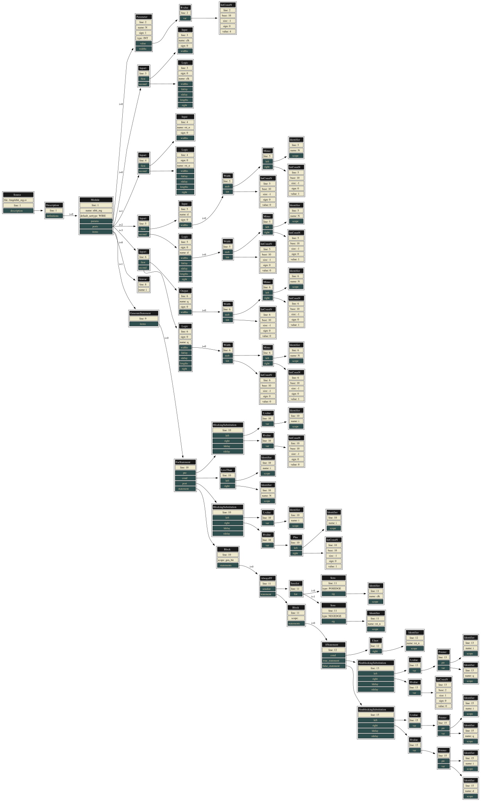
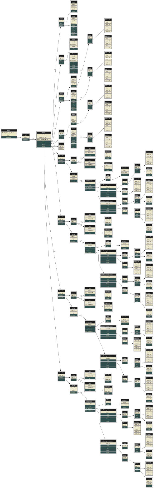

# `veriflat` — Hierarchy Flattener

`veriflat` takes a Verilog or SystemVerilog design and flattens the module
hierarchy into a single self-contained module. Along the way it resolves the
constructs that parameterize a design — parameters, `localparam`s, enums,
typedefs, packed structs, generate blocks, constant functions — so the output
is plain, widely-supported RTL: functionally equivalent to the input, valid,
human-readable, and free of hierarchy.

Two use cases drive it:

- **IP delivery**: flatten (then obfuscate with
  [`veriobf`](veriobf.md)) a design so it can be shipped as one functional,
  simulatable file that is hard to reverse-engineer.
- **RTL elaboration / retargeting**: unroll and constant-fold complex ROM or
  LUT initialization (Verilog functions, generate loops) into constructs that
  FPGA toolchains with limited synthesis support accept.

## Command-line reference

```
Usage: veriflat [options] verilog-file [verilog-file ...]

options:
  -h [ --help ]              Produce help message
  -v [ --version ]           Show the version and exit
  -o [ --output ] arg        output
  -t [ --top-module ] arg    top-module
  -p [ --param-map ] arg     YAML parameter map
  -e [ --deadcode-end ]      Remove deadcode after flatten pass
  -d [ --deadcode-during ]   Remove deadcode during flatten pass
  --fsm                      Compile (* veriparse_fsm *) processes into explicit
                             machines, each instance at its own parameters
                             (ADR-0014)
  --suffix arg               Append to the emitted module's name, so the output
                             can sit beside its source in one testbench
  --sv                       Enable SystemVerilog mode
  -I [ --include-dir ] arg   Add directory to `include search path (repeatable)
  -D [ --define ] arg        Predefine a macro as NAME or NAME=BODY (repeatable)
  -U [ --undef ] arg         Cancel a predefine NAME (repeatable)
  -s [ --seed ] arg (=0)     Seed value
  --log arg                  Log to FILE instead of stderr
```

Preprocessing (`` `include ``, `` `define ``) is built in — pass the source
files and any `-I`/`-D` flags directly. `--sv` switches the parser to
SystemVerilog (IEEE 1800-2017 keywords and constructs); without it the input
is parsed as Verilog (IEEE 1364-2005). The `--seed` value makes the generated
unique names reproducible from run to run.

## Parameter map

`-p` controls **partial parameter inlining**: which top-module parameters are
kept as parameters and which are folded as constants. The argument is a YAML
map:

| Map | Meaning |
|---|---|
| `{}` | inline all parameters (fully flatten) — the default |
| `{PARAM_A:}` | keep `PARAM_A` as a module parameter, inline all others |
| `'{PARAM_A: null, PARAM_B: null}'` | keep `PARAM_A` and `PARAM_B`, inline all others |
| `{PARAM_A: 42}` | override `PARAM_A` with value 42, inline all others |

**Example:**

```sh
# Flatten, keeping FIFO_WIDTH as a parameter
veriflat -p '{FIFO_WIDTH:}' --seed 0 --top-module top -I src/ src/top.v src/sub.v --output top_flat.v
```

## What flattening involves

For each module, `veriflat` runs the resolution pipeline (see
[passes.md](passes.md), `ResolveModule`): I/O normalization, parameter and
`localparam` inlining, enum/typedef/struct lowering, constant folding, loop
unrolling, branch selection, generate resolution, and instance
normalization. Then the flattener binds each instance into its parent —
uniquifying names, elevating scoped declarations, splitting instance
arrays — until a single module remains.

Dead-code elimination is optional: `-d` prunes unused logic while
flattening (keeps intermediate results small), `-e` prunes once at the end.

## `--fsm` — compile marked processes while flattening

With `--fsm`, the flattener enables [`verilower`](verilower.md)'s
imperative-FSM elaboration (ADR-0014) inside its per-instance resolution.
Since every instance is resolved with **its own parameters** before
inlining, this compiles the one shape a per-module `verilower` run cannot:
a marked module instantiated several times with different parameter
overrides.

```systemverilog
pulse_ctr #(.N(3)) u_fast (...);   // both instances of a
pulse_ctr #(.N(6)) u_slow (...);   // (* veriparse_fsm *) marked module
```

```sh
veriflat --sv --fsm -t top -o top_flat.sv top.sv
```

Each instance's machine is compiled at its own `N` — separately sized
countdowns, states, and encodings — and the flattening uniquifies the
generated names (`u_fast___fsm_state`, `u_slow___fsm_state`) like any
other declaration. Under `--fsm` the synthesizable-subset check moves
from the input (which legitimately suspends on edge waits) to the
flattened output, exactly as in `verilower`.

Without `--fsm`, a marked design still flattens: the processes pass
through as-is with their attributes intact — so a downstream `verilower`
run per module still works — and an info note names the flag. The
`--suffix` option renames the emitted module (as in `verilower`) so a
flattened machine can sit beside its behavioural source in one
differential testbench.

## SystemVerilog example: generate-loop flattening

A parametric N-bit register where each bit is handled by a dedicated
`always_ff` block inside a `generate` loop:

```systemverilog
module nbit_reg
  #(parameter int N = 4)
  (input  logic         clk,
   input  logic         rst_n,
   input  logic [N-1:0] d,
   output logic [N-1:0] q);

  genvar i;
  generate
    for (i = 0; i < N; i = i + 1) begin : gen_bit
      always_ff @(posedge clk or negedge rst_n) begin
        if (!rst_n)
          q[i] <= 1'b0;
        else
          q[i] <= d[i];
      end
    end
  endgenerate

endmodule
```

Flatten with `veriflat` (inlines `N=4` by default):

```sh
veriflat --sv -t nbit_reg -o nbit_reg_flat.sv nbit_reg.sv
```

Result — the generate loop is unrolled into four independent `always_ff`
blocks:

```systemverilog
module nbit_reg (input logic clk,
                 input logic rst_n,
                 input logic [3:0] d,
                 output logic [3:0] q);

  genvar i;

  always_ff @(posedge clk or negedge rst_n) begin
    if(!rst_n) q[0] <= 1'b0;
    else       q[0] <= d[0];
  end

  always_ff @(posedge clk or negedge rst_n) begin
    if(!rst_n) q[1] <= 1'b0;
    else       q[1] <= d[1];
  end

  always_ff @(posedge clk or negedge rst_n) begin
    if(!rst_n) q[2] <= 1'b0;
    else       q[2] <= d[2];
  end

  always_ff @(posedge clk or negedge rst_n) begin
    if(!rst_n) q[3] <= 1'b0;
    else       q[3] <= d[3];
  end

endmodule
```

AST before flattening (with generate loop):



AST after flattening (unrolled):



## Supported input subset

The parser and passes support a significant subset of *synthesizable*
Verilog (IEEE 1364-2005) and SystemVerilog (IEEE 1800-2017): generate
blocks, `always_ff`/`always_comb`/`always_latch`, `logic` and 2/4-state
integer types, packages and `import`, interfaces with modports, packed
structs/unions, enums, typedefs, type parameters, and casts. Design
decisions and their exact boundaries are recorded per feature in the
`docs/adr-*.md` series; the pass-by-pass reference is
[passes.md](passes.md). Constructs outside the supported subset are
rejected with a diagnostic naming the source line, never silently dropped.
